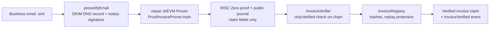

# ProofInvoice: Verifiable Business Invoice Infrastructure

A vlayer Grants MVP. ProofInvoice converts **authenticated business email claims into
privacy-preserving, cryptographically verifiable claims** that EVM smart contracts can consume —
using real [vlayer Email Proofs](https://docs.vlayer.xyz/), not simulations.

> A user can prove selected claims contained in an authenticated business email — invoice identity,
> issuer domain, amount, currency, due date — and have those claims cryptographically verified and
> consumed by an EVM smart contract, without putting the complete private email on-chain.

---

## What ProofInvoice is NOT

This is explicitly **not**:

- a generic email verifier
- a centralized invoice database
- a payment processor
- a replacement for accounting software
- a claim that any invoice is economically legitimate

Its sole purpose is to provide a **privacy-preserving cryptographic bridge between authenticated
business email claims and smart-contract workflows**.

---

## Problem

Invoice-backed workflows (financing, escrow, audit) need to know: *"did an invoice with these exact
terms really come from this issuer's domain?"* Today that question is answered by centralized APIs
that read private mailboxes, or by trust-me databases. Smart contracts cannot read email, and
putting business email on-chain is unacceptable.

## Solution

vlayer Email Proofs close the gap:

1. The email's DKIM signature is verified inside a zkEVM against the sender's live DNS record,
   countersigned by a DNS notary — the email is cryptographically authenticated.
2. A **Prover** contract extracts only the invoice claim fields from the authenticated content.
3. Only those extracted fields become the **public journal**; the full email stays private.
4. A RISC Zero proof binds the journal to the prover contract and function.
5. An on-chain **Verifier** checks the seal and writes the claim into a **Registry**.

## Why vlayer

- Ordinary database attestations require trusting the operator. A zk proof requires trusting only
  cryptography and DNS.
- Centralized mailbox-reading APIs demand broad OAuth scopes on private inboxes. Here the raw email
  never leaves the proving environment, and only five hashed/scalar fields become public.
- DKIM authentication is already deployed on every serious business mail server — vlayer turns that
  existing infrastructure into an on-chain trust anchor without new sender-side work.

## Architecture



## Privacy model

| Value | On-chain? | Notes |
|---|---|---|
| Full email / MIME body | **never** | private prover input inside the zkEVM |
| DKIM DNS record + notary signature | **never** | private prover input |
| Invoice ID | hash only | `keccak256(upper(invoiceId))` |
| Issuer domain | hash only | `keccak256(lower(domain))`, derived from the authenticated `From` header |
| Amount (minor units) | **yes, public** | needed to be useful; contains no personal data |
| Currency (ISO-4217) | **yes, public** | `bytes3` |
| Due date | **yes, public** | days since epoch |
| Submitter address | **yes, public** | who paid for the verification tx |

## Threat model — what the proof does and does not establish

**Proved:**

- the email was DKIM-authenticated for the stated sender domain (per the supported mechanism)
- the claimed fields were present in that authenticated content
- the proof is valid, bound to this prover contract and function, on this chain
- the exact claim has not been consumed before (replay protection)

**NOT proved — do not rely on this system for:**

- that the supplier is economically legitimate
- that the invoice represents a genuine commercial transaction
- that the underlying goods/services were delivered
- that the invoice amount is commercially correct
- that the sender's mail account has not been compromised (DKIM proves the domain signed the mail,
  not the intentions of whoever controls the account)
- that the recipient legally owes the amount

**Never collected:** email passwords, OAuth tokens, private keys (beyond the settlement key you
configure yourself), seed phrases, authentication cookies.

---

## vlayer integration

Everything below uses the **official, current** vlayer stack (verified against
[docs.vlayer.xyz](https://docs.vlayer.xyz/) and [vlayer-xyz/vlayer](https://github.com/vlayer-xyz)
at implementation time):

| Component | Used here |
|---|---|
| TypeScript SDK | `@vlayer/sdk` **1.5.1** (`createVlayerClient`, `preverifyEmail`) |
| Solidity contracts | `vlayer.zip` release asset from `vlayer-xyz/vlayer` **v1.5.1** (`Prover`, `Verifier`, `EmailProofLib`, `RegexLib`, `Proof`) |
| Prover pattern | `ProofInvoiceProver is Prover`, `main(UnverifiedEmail)` returns `Proof` + claim fields; private input stays private |
| Verifier pattern | `InvoiceVerifier is Verifier`, `onlyVerified(prover, ProofInvoiceProver.main.selector)` re-derives the journal from the submitted arguments |
| Devnet | docker compose `vdns_server` (:3002) + `call_server` (:3000), anvil at 31337 |
| Env vars | `VLAYER_URL`, `DNS_SERVICE_URL`, `VLAYER_API_TOKEN`, `CHAIN_NAME`, `JSON_RPC_URL` |
| Compiler | solc **0.8.28** (vlayer 1.5.1 pin), Foundry |

Record of packages/versions: `@vlayer/sdk@1.5.1`, vlayer Solidity `v1.5.1`, forge-std `1.9.4`,
OpenZeppelin `5.0.1`, risc0-ethereum `3.0.0` — all pinned with SHA-256 digests in
`scripts/fetch-vlayer-contracts.mjs`.

### Claim schema

```solidity
struct InvoiceClaim {
    bytes32 invoiceIdHash;      // keccak256(upper(invoiceId))
    bytes32 issuerDomainHash;   // keccak256(lower(domain from authenticated From))
    uint256 amountMinor;        // ISO-4217 minor units
    bytes3  currency;           // ISO-4217 alpha-3
    uint64  dueDateDays;        // days since epoch (UTC)
}
```

The prover extracts fields from the authenticated body using vlayer's regex precompile:
`Invoice-ID:`, `Amount:`, `Currency:`, `Due-Date:` inside a `ProofInvoice/1` claim block, plus the
domain from the authenticated `From` header.

## Contracts

| Contract | Role |
|---|---|
| `ProofInvoiceProver` | vlayer Prover; verifies DKIM, extracts claim, emits journal |
| `InvoiceVerifier` | verifies the RISC Zero seal via vlayer `Verifier`, re-validates claim, forwards to registry |
| `InvoiceRegistry` | stores records (hashes + scalars), one-shot verifier wiring, replay + duplicate-invoice protection, optional issuer allow-list, audit events |

Deployed addresses: none published yet. This README will only ever list real addresses after an
actual deployment — none are invented here.

## Project layout

```
contracts/          Foundry project (src, test, script)
src/                TypeScript app
  email/            .eml parsing + claim extraction (client-side mirror of the prover)
  vlayer/           @vlayer/sdk client, ABIs, settlement, chains
  server/           express API + static frontend
  metrics/          grant KPI counters
  config.ts         strict env loading (fail-fast, demo/live modes)
frontend/           minimal demo UI
fixtures/           deterministic .eml demo emails
tests/              vitest unit tests (+ tests/integration for live E2E)
scripts/            dependency installer, metrics exporter
```

---

## Installation

Prerequisites: Node ≥ 20, [Foundry](https://book.getfoundry.sh/)
(`curl -L https://foundry.paradigm.xyz | bash && foundryup`), Docker (devnet only).

```bash
git clone https://github.com/Pillar-5/proofinvoice-vlayer.git
cd proofinvoice-vlayer
npm install                 # app dependencies
npm run contracts:install   # pinned vlayer/foundry deps (sha256-verified)
npm run contracts:build     # forge build (solc 0.8.28)
```

## Configuration

```bash
cp .env.example .env
```

| Variable | Meaning |
|---|---|
| `PROOFINVOICE_MODE` | `demo` (default): parser/UI/metrics only; proof endpoints fail with HTTP 409 instead of faking. `live`: real proving + settlement. |
| `VLAYER_URL` | vlayer prover API (devnet `call_server`: `http://127.0.0.1:3000`) |
| `DNS_SERVICE_URL` | DKIM DNS resolver (devnet `vdns_server`: `http://127.0.0.1:3002`, hosted: `https://test-dns.vlayer.xyz`) |
| `VLAYER_API_TOKEN` | only for hosted proving |
| `CHAIN_NAME` | `anvil` (devnet) or sepolia / base-sepolia / optimism-sepolia / arbitrum-sepolia |
| `CHAIN_ID` | chain id sent with the proving request (devnet: 31337) |
| `JSON_RPC_URL` | settlement RPC |
| `PROVER_ADDRESS` / `VERIFIER_ADDRESS` / `REGISTRY_ADDRESS` | deployed contracts |
| `PRIVATE_KEY` | settlement tx signer (anvil default key for devnet) |
| `PORT` | HTTP port (default 3000) |

Never commit `.env`. The repository contains `.env.example` only.

## Local development

```bash
npm run dev          # tsx src/server/main.ts -> http://localhost:3000
npm run typecheck    # strict tsc
npm run build        # tsc -> dist/
npm start            # node dist/src/server/main.js
```

## Test

```bash
npm test                     # app unit tests (no external services)
npm run contracts:test       # forge test: 39 Solidity tests
npm run contracts:fmt        # forge fmt --check
npm run test:integration     # LIVE end-to-end; skips unless the full vlayer env is configured
```

## Deployment

Local devnet:

```bash
docker compose -f contracts/compose.yaml up -d   # vlayer devnet (call_server, vdns_server)
anvil                                            # terminal 1
cd contracts && forge script Deploy --rpc-url anvil --broadcast
```

Then set `PROVER_ADDRESS`, `VERIFIER_ADDRESS`, `REGISTRY_ADDRESS` in `.env` and run with
`PROOFINVOICE_MODE=live`.

Testnet (requires a funded key + RPC in `contracts/foundry.toml`):

```bash
cd contracts && forge script Deploy --rpc-url sepolia --broadcast --verify
```

## Demo

Reproducible demo without any external account:

```bash
npm install && npm run contracts:install && npm run contracts:build
npm run dev
# open http://localhost:3000
#   1. pick fixtures/invoice-sample.eml  ->  "Parse claims"
#   2. live counters at /api/metrics
```

In demo mode the UI shows parsing and metrics; pressing *Generate vlayer Proof* fails **loudly**
(HTTP 409) explaining exactly what is missing — it never pretends to prove. The complete live demo
(devnet → real proof → on-chain verification) is documented under Deployment and exercised by
`npm run test:integration`.

## Metrics

`GET /api/metrics` (and `npm run metrics:export`) report application-generated counters:

```json
{
  "proof_attempts": 0,
  "proofs_generated": 0,
  "proofs_failed": 0,
  "onchain_verifications": 0,
  "invoices_verified": 0,
  "issuer_domains": 0,
  "avg_proof_ms": null
}
```

Values are never fabricated; they reset on process restart. No personal information is collected.

## Proposed post-MVP KPIs (targets, not achievements)

*Initial prototype:* 1 working Email Proof flow · 1 deployed Verifier · 1 deployed Registry · 1
end-to-end demonstration.

*First grant-funded phase (targets, revisable):* 100 verified invoice proofs · 50 verified invoice
records · 10 test organizations/domains · 100 on-chain verification events.

---

## Grant relevance

ProofInvoice is a candidate for the vlayer Grants programme because it demonstrates a
non-social, high-value use of Email Proofs: **business documents that already carry DKIM
signatures become machine-verifiable on-chain claims**. It exercises the full stack — email
preverification, regex extraction in the zkEVM, private inputs with a minimal public journal,
on-chain `onlyVerified` consumption, and replay-protected registry state — and ships reproducible
tests and metrics for both. The grant has **not** been approved; this repository is the application
MVP.

## License

MIT
