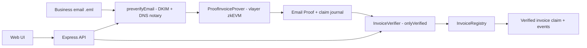

ProofInvoice converts authenticated business email information into privacy-preserving, verifiable invoice claims that can be consumed by EVM smart contracts.

## Overview

ProofInvoice takes a DKIM-authenticated business invoice email, extracts a small structured claim (invoice ID, issuer domain, amount, currency, due date), turns it into a vlayer Email Proof, and registers the verified claim on-chain — without ever putting the email itself on-chain.

Built on [vlayer Email Proofs](https://book.vlayer.xyz/features/email.html): the email's DKIM signature is verified inside a zkEVM prover, regexes extract the invoice fields from the authenticated content, and a succinct ZK proof lets the on-chain `InvoiceVerifier` accept the claim. Only hashed/derived claim values reach the blockchain.

## How it works

```text
Authenticated business email (.eml)
        ↓
DKIM verification (vlayer preverifyEmail + zkEVM)
        ↓
Invoice claim extraction (regex inside the prover)
        ↓
Cryptographic proof (vlayer prove / waitForProvingResult)
        ↓
On-chain verification (InvoiceVerifier.onlyVerified)
        ↓
Verified invoice claim (InvoiceRegistry + events)
```

## Why ProofInvoice

Business email contains structured, operationally useful information — invoices, approvals, orders — that normally stays locked inside private mailboxes. Smart contracts cannot consume it, and screenshot-based or self-reported integrations provide no cryptographic guarantee.

ProofInvoice bridges that gap: it verifies the cryptographic properties of authenticated email (DKIM signature, sender domain, exact content) and exposes only the fields an application needs, as a compact on-chain claim. The email stays private; the claim becomes verifiable.

## Key capabilities

- **Authenticated email verification** — DKIM signature checked against the sender domain's DNS record inside the vlayer zkEVM
- **Issuer-domain binding** — the claim's issuer domain comes from the authenticated `From` header, never from the body
- **Structured claim extraction** — invoice ID, amount, currency, due date extracted by regex from authenticated content only
- **Privacy-preserving proof generation** — only the extracted claim is published; the full email never leaves the proving step
- **Cryptographic on-chain verification** — `InvoiceVerifier` validates the proof seal, prover identity, and claim digest via `onlyVerified`
- **Replay protection** — the registry rejects duplicate claim hashes and invoice IDs
- **Deterministic claim schema** — hashes and minor-unit scalars, identical off-chain and in the prover
- **Developer API + reproducible local development** — deterministic fixtures, offline test suite, local devnet option, and a hosted testnet path

## Privacy

**Private (never on-chain):** the raw `.eml`, headers, subject, body, recipient address, and any personal information. The email exists only as private prover input.

**Public (on-chain, by design):**

| Field | Representation |
|---|---|
| Invoice ID | `keccak256` hash |
| Issuer domain | `keccak256` hash |
| Amount | `uint256` in ISO-4217 minor units |
| Currency | `bytes3` (alpha-3 code) |
| Due date | `uint64` days since Unix epoch |
| Claim identity | `keccak256` of the packed claim |

See [docs/security-and-trust.md](docs/security-and-trust.md) for the full trust model.

## Architecture



Modules: `src/email` (parsing/claim extraction), `src/vlayer` (prover client, settlement, chains), `contracts/src` (Solidity), `src/server` (API), `frontend/` (UI), `src/metrics` (counters).

## Invoice claim

```text
InvoiceClaim {
    invoiceIdHash     bytes32   keccak256(upper-cased invoice ID)
    issuerDomainHash  bytes32   keccak256(lower-cased DKIM-authenticated From domain)
    amountMinor       uint256   ISO-4217 minor units
    currency          bytes3    ISO-4217 alpha-3
    dueDateDays       uint64    days since Unix epoch (UTC)
}
```

The TypeScript parser (`src/email/claims.ts`) mirrors the Solidity prover regexes exactly, so what the UI shows is what the prover will extract and verify.

## vlayer integration

Version: **`@vlayer/sdk@1.5.1`** with the official **vlayer v1.5.1** Solidity contracts. See [docs/vlayer-version.md](docs/vlayer-version.md) for the version audit.

| Component | Usage |
|---|---|
| `preverifyEmail` | DKIM/DNS-notary preverification of the `.eml` (`src/vlayer/client.ts`) |
| `createVlayerClient` → `prove` → `waitForProvingResult` | real proof generation against the configured prover |
| `Prover` / `EmailProofLib` / `RegexLib` | `contracts/src/vlayer/ProofInvoiceProver.sol` — DKIM verify + claim extraction in the zkEVM |
| `Verifier` / `onlyVerified` | `contracts/src/vlayer/InvoiceVerifier.sol` — on-chain proof check and claim registration |
| Official env vars | `PROVER_URL`, `DNS_SERVICE_URL`, `VLAYER_API_TOKEN`, `VLAYER_ENV`, `CHAIN_NAME`, `JSON_RPC_URL` |

## Getting started

```bash
git clone https://github.com/Pillar-5/proofinvoice-vlayer.git
cd proofinvoice-vlayer
npm install
npm run contracts:install   # pins official vlayer/forge-std/OpenZeppelin releases (sha256-verified)
npm run contracts:build
cp .env.example .env        # then edit .env
npm run dev                 # http://localhost:3000
```

Without further configuration the app runs in **local demonstration** mode: it parses emails, extracts claims, and walks you through the full workflow, and states clearly that cryptographic verification requires the configured vlayer proving environment. Configure `.env` (see [docs/live-demo.md](docs/live-demo.md)) to run the real proof flow.

## Local development

```bash
npm run contracts:install   # install pinned Solidity dependencies
npm run contracts:build     # forge build (solc 0.8.28)
npm run contracts:test      # forge test (39 tests)
npm test                    # vitest unit suite (23 tests)
npm run typecheck           # tsc --noEmit
npm run build               # production build to dist/
npm run test:integration    # live end-to-end test (skips without live config)
```

Optional full local devnet (Docker): `cd contracts && docker compose up -d`, then set `PROVER_URL=http://127.0.0.1:3000`, `DNS_SERVICE_URL=http://127.0.0.1:3002`, `CHAIN_NAME=anvil`.

## Testnet deployment

```bash
cd contracts
PRIVATE_KEY=<test wallet key> forge script script/Deploy.s.sol \
  --rpc-url $JSON_RPC_URL --broadcast
```

The script deploys `ProofInvoiceProver`, `InvoiceRegistry`, and `InvoiceVerifier`, wires the registry to the verifier, prints all addresses, and records the run in `contracts/broadcast/` (git-ignored). Copy the printed addresses into `.env`. Details and the complete live flow: [docs/live-demo.md](docs/live-demo.md).

## Live proof demonstration

See [docs/live-demo.md](docs/live-demo.md) — preparing a DKIM-signed test email, configuring the hosted testnet prover, running the full `email → proof → on-chain claim` flow, and inspecting the result on a block explorer.

## API

| Endpoint | Description |
|---|---|
| `GET /api/config` | runtime configuration and component status |
| `GET /api/fixtures` | list deterministic sample emails |
| `GET /api/fixtures/:name` | fetch a sample `.eml` |
| `POST /api/parse` | parse an uploaded `.eml` and extract the invoice claim |
| `POST /api/proof` | generate a real vlayer Email Proof (requires live config) |
| `GET /api/proof/:id` | poll proving status/result |
| `POST /api/verify/:id` | submit the proof to `InvoiceVerifier` and register the claim |
| `GET /api/metrics` | application counters (proofs, verifications, timings) |

## Contracts

| Contract | Role |
|---|---|
| `ProofInvoiceProver` | vlayer `Prover`; DKIM-verifies the email in the zkEVM and extracts the invoice claim from authenticated content |
| `InvoiceVerifier` | vlayer `Verifier`; validates the proof via `onlyVerified`, re-validates the claim, forwards to the registry |
| `InvoiceRegistry` | stores verified claims (hashes/scalars only), replay protection, `InvoiceVerified` events, single-verifier access control |

## Security

See [docs/security-and-trust.md](docs/security-and-trust.md) for what the system proves, what it deliberately does not, and its trust assumptions.

## Deployments

### Ethereum Sepolia (chain ID 11155111)

| Contract | Address |
|---|---|
| ProofInvoiceProver | [`0xBebf4c83daC02579024f273972aEd796d0086aA1`](https://sepolia.etherscan.io/address/0xBebf4c83daC02579024f273972aEd796d0086aA1) |
| InvoiceRegistry | [`0x7663c39DC4f0a8f3c255B2Da4fa465be0a426514`](https://sepolia.etherscan.io/address/0x7663c39DC4f0a8f3c255B2Da4fa465be0a426514) |
| InvoiceVerifier | [`0x0Eef53E811E5e1Cf3E4B61e60Bb539d4d29a10E4`](https://sepolia.etherscan.io/address/0x0Eef53E811E5e1Cf3E4B61e60Bb539d4d29a10E4) |

Deployment transactions: [Prover](https://sepolia.etherscan.io/tx/0xbc1644f3d99513c7ef398b467a6dd2162afc46adf8cda58afe1b7ca7af2415b4), [Registry](https://sepolia.etherscan.io/tx/0x27fc1cbb3daa4037076e65189f5323359308c5725f257ae57d84780d44617da9), [Verifier](https://sepolia.etherscan.io/tx/0x45a663729546a014d9c7d8f7ddcc2495eb3c3c3c0587f56a5af3416602ef34a5), [registry→verifier wiring](https://sepolia.etherscan.io/tx/0xe577c26cd80a5ee39574e24a9414914c40380b4f2de66de05bba33b30d97f5f2).

## Repository structure

```text
contracts/          Foundry project (Prover, Verifier, Registry, tests, deploy script)
src/email/          .eml parsing and invoice claim extraction
src/vlayer/         vlayer client, prover ABI, settlement, chain table
src/server/         Express API
src/metrics/        application counters
frontend/           single-page UI
fixtures/           deterministic sample .eml files (development only, not proofs)
docs/               security-and-trust.md, live-demo.md, vlayer-version.md, demo artifacts
tests/              vitest unit + integration suites
```

## License

MIT — see [LICENSE](LICENSE).

