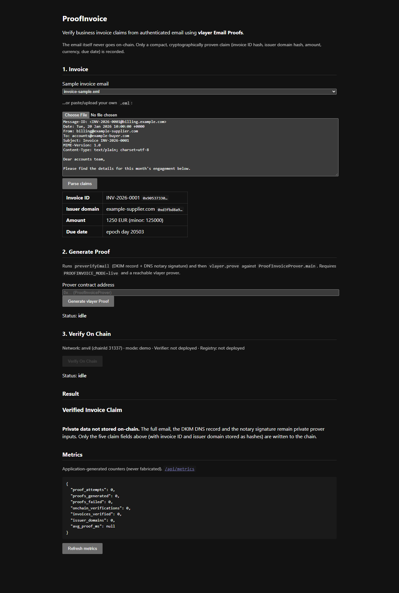

# ProofInvoice — demo output

Captured from a live run of the deterministic demo (demo mode, no external
services). Reproduce with:

```bash
npm install && npm run contracts:install && npm run contracts:build
npm run build && npm run dev      # or: npm run dev
```

UI screenshot (auto-loads `fixtures/invoice-sample.eml` and parses it):


## 1. Fixture list — `GET /api/fixtures`

```json
{"fixtures":[{"name":"invoice-acme-valid.eml"},{"name":"invoice-malformed.eml"},{"name":"invoice-sample.eml"},{"name":"invoice-second.eml"}]}
```

## 2. Parse — `POST /api/parse` with `invoice-sample.eml`

```json
{
  "claim": {
    "invoiceId": "INV-2026-0001",
    "issuerDomain": "example-supplier.com",
    "amountMinor": "125000",
    "currency": "EUR",
    "dueDateDays": "20503",
    "invoiceIdHash": "0x905373307d597fac2ae5d3a92554b3c2274054f9380f99f337e993c8503d82f…",
    "issuerDomainHash": "0xd3ffbd8a9…"
  },
  "diagnostics": []
}
```

The two hashes are exactly what `InvoiceClaimLib.build` derives on-chain — the
UI preview and the zkEVM prover agree by construction.

## 3. Runtime configuration — `GET /api/config`

```json
{"mode":"demo","network":"anvil","chainId":31337,"vlayerUrl":null,
 "dnsResolverUrl":"https://test-dns.vlayer.xyz","proverAddress":null,
 "verifierAddress":null,"registryAddress":null}
```

## 4. Demo mode refuses to fake proving — `POST /api/proof` → HTTP 409

```json
{"error":"Server is in demo mode (PROOFINVOICE_MODE=demo): real proof
generation and on-chain settlement are disabled. Set PROOFINVOICE_MODE=live
with PROVER_URL and deployed contract addresses to enable them."}
```

This is deliberate: ProofInvoice fails loudly rather than silently substituting
a fake "proof".

## 5. Metrics — `GET /api/metrics`

```json
{
  "proof_attempts": 0,
  "proofs_generated": 0,
  "proofs_failed": 0,
  "onchain_verifications": 0,
  "invoices_verified": 0,
  "issuer_domains": 0,
  "avg_proof_ms": null
}
```

Counters move only when real proofs/settlements happen through the live
pipeline; nothing is fabricated.

## 6. The full live path (requires the vlayer devnet)

With `contracts/compose.yaml` up, anvil running, contracts deployed
(`forge script script/Deploy.s.sol --rpc-url anvil --broadcast`) and
`PROOFINVOICE_MODE=live` in `.env`:

1. `POST /api/proof` → runs `preverifyEmail` (DKIM DNS record + notary
   signature) then `vlayer.prove` on `ProofInvoiceProver.main` — real zk
   proving;
2. `GET /api/proof/:id` until `state: "proved"` (returns the RISC Zero seal +
   call assumptions + the five claim outputs);
3. `POST /api/verify/:id` → `InvoiceVerifier.verifyAndRegister` on-chain
   (re-derives the journal via `onlyVerified`, checks the seal, writes the
   record) → returns tx hash, claim hash, block;
4. `GET /api/metrics` shows the counters incremented.

`npm run test:integration` automates exactly this sequence and asserts the
registry reports the claim as verified on-chain.
